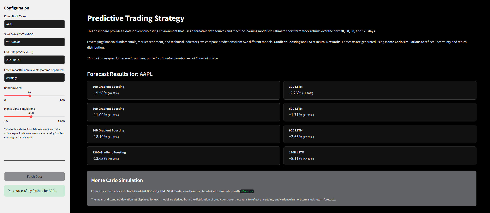
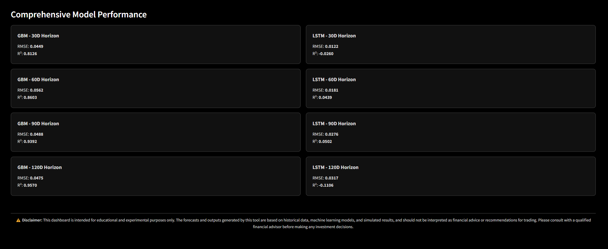
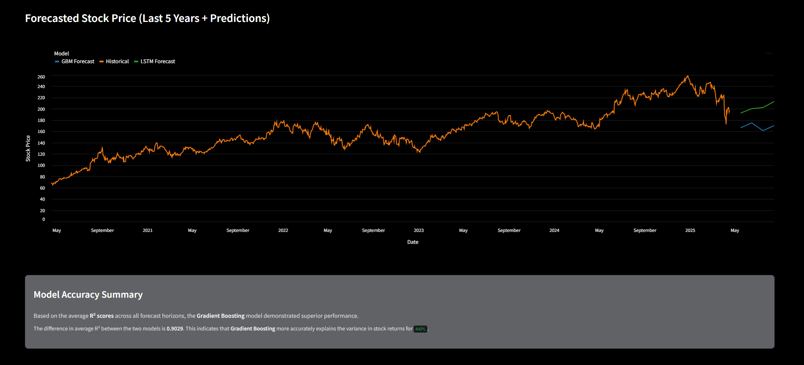

# 📈 Predictive Trading Strategy Dashboard

A cutting-edge Streamlit application that forecasts short-term stock returns using Gradient Boosting and LSTM models. By integrating financial fundamentals, sentiment analysis, and technical indicators, this dashboard provides insightful predictions to aid in trading strategies.


---

## 🧠 Features

- **Multi-Horizon Forecasting**: Predict stock returns over 30, 60, 90, and 120-day periods.
- **Model Comparison**: Evaluate predictions from both Gradient Boosting and LSTM models.
- **Monte Carlo Simulations**: Incorporate uncertainty by running multiple simulations for each prediction.
- **Interactive Visualizations**: Explore forecasts and historical data through dynamic charts.
- **User Input**: Customize predictions by entering specific stock tickers and news events.

---

## 🖼️ UI Snapshots

### 1. Dashboard Overview


### 2. Model Performance Comparison



### 3. Forecast Visualizations



---

## ⚙️ Installation

1. **Clone the Repository**:

   ```bash
   git clone https://github.com/yourusername/predictive-trading-dashboard.git
   cd predictive-trading-dashboard
   ```

2. **Create a Virtual Environment**:

   ```bash
   python -m venv venv
   source venv/bin/activate  # On Windows: venv\Scripts\activate
   ```

3. **Install Dependencies**:

   ```bash
   pip install -r requirements.txt
   ```

4. **Run the Application**:

   ```bash
   streamlit run app.py
   ```

---

## 📝 Usage

1. **Enter Stock Ticker**: Input the desired stock symbol (e.g., AAPL).
2. **Set Date Range**: Specify the start and end dates for historical data analysis.
3. **Input News Events**: Add any relevant news events that might impact stock performance.
4. **Configure Simulations**: Adjust the number of Monte Carlo simulations and random seed as needed.
5. **Fetch Data**: Click the "Fetch Data" button to retrieve and process all necessary information.
6. **View Predictions**: Explore the forecasted returns and model performance metrics.

---

## 📊 Model Improvement Suggestions

- **Incorporate Additional Data Sources**: Integrate macroeconomic indicators or alternative data to enhance model accuracy.
- **Hyperparameter Tuning**: Employ techniques like Grid Search or Bayesian Optimization for optimal model parameters.
- **Feature Engineering**: Develop new features that capture market anomalies or investor sentiment more effectively.
- **Model Ensemble**: Combine predictions from multiple models to improve robustness.
- **Regular Updates**: Continuously update the models with new data to maintain prediction relevance.

---

## ⚠️ Disclaimer

This dashboard is intended for educational and experimental purposes only. The forecasts and outputs generated are based on historical data, machine learning models, and simulated results. They should not be interpreted as financial advice or recommendations for trading. Please consult with a qualified financial advisor before making any investment decisions.

---

## 🙌 Acknowledgements

- [Streamlit](https://streamlit.io/) for the interactive web framework.
- [scikit-learn](https://scikit-learn.org/) and [PyTorch](https://pytorch.org/) for machine learning libraries.
- [Altair](https://altair-viz.github.io/) for data visualization.
